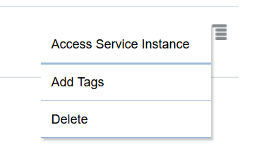
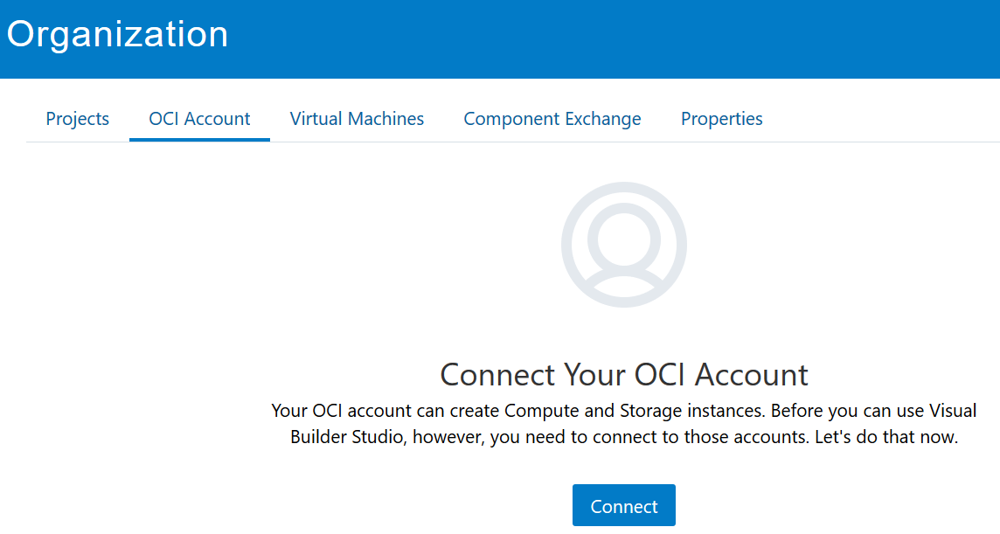
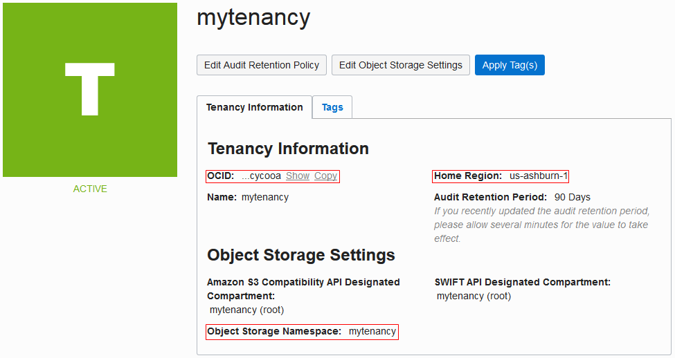
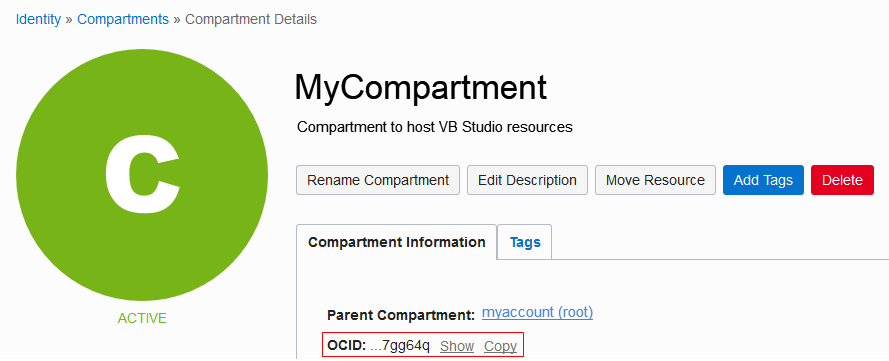
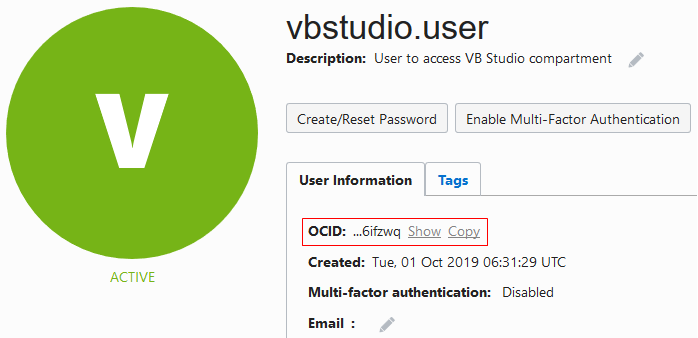
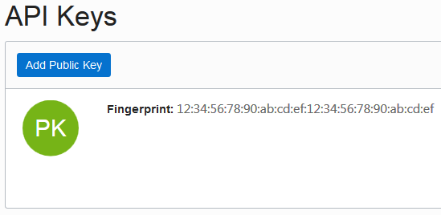
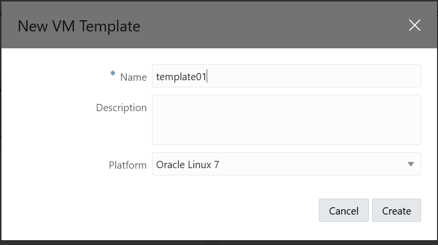
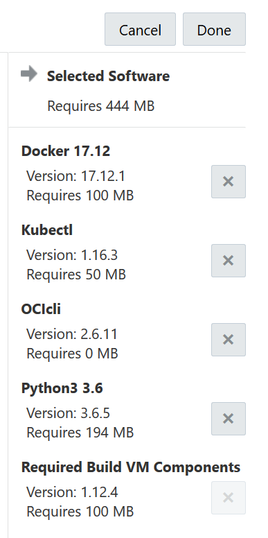
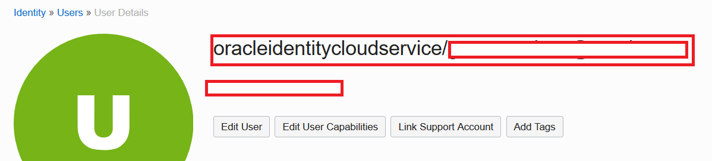

# Creating a Project

At this lab you will create your first Oracle Visual Builde Studio project, this includes creating your first VM Template, Build VM, and also connect this project to your Oracle Cloud Infraestructure Registry.

## Configuring your Visual Builder Studio

1. Access the OCI console:
[Sign In](https://console.us-ashburn-1.oraclecloud.com/)

2. Input your **tenancy name**, then click on **Next**.

3. On the Oracle Cloud Account sign-in page, enter your Oracle Cloud account credentials, and click **Sign In**.

4. On the OCI Console, click on the **Menu icon** in the top-left corner.

5. Under **Platform Services**, and then select **Developer**.

6. On the right corner of your  **Visual Builder Studio** click on the **Menu icon**, then click on **Access Console**.
_If nothing shows, please refer to the [documentation](https://docs.oracle.com/en/cloud/paas/developer-cloud/csdcs/service-setup.html#GUID-5AEF0534-6181-488E-A996-3DF97F6278A3) to create a new instance_

7. **Scroll Down** and click on **OCI Account**, to link the instance with your OCI Tenancy.

8. Click in **Connect**.

9. Getting the required information:

   _QUICK TIP: copy this information to a notepad, you will need them to later steps of this workshop_

    #### Tenancy OCID, Home Region, and Storage Namespace:
    Open the OCI console. In the navigation menu, under **Governance and Administration**, select **Administration**, and then select **Tenancy Details**.
    The Tenancy Information tab displays the **tenancy OCID** in OCID, the **home region** in Home Region, and the **storage namespace** in Object Storage Namespace.

    

    ####  Compartment OCID:
    Open the OCI console. In the navigation menu, under **Governance and Administration**, select **Identity**, and then select **Compartments**. On the Compartments page, click the compartment's name.
    The Compartment Information tab displays the **compartment's OCID** in OCID. Click the Copy link to copy the compartment's OCID to the clipboard.

    

    #### User OCID, Finger Print, and Publick/Private Key:
    _IMPORTANT: We will use a standard key pair to execute this workshop, DO NOT USE THIS KEYS IN YOUR PRODUCTION ENVIRONMENT, THIS KEYS ARE SOLELY TO DEMONSTRATION PURPOSE_

    **Private Key:** [oci_api_key.pem](./src/oci_api_key.pem)
    **Public Key:** [oci_api_key_public.pem](./src/oci_api_key_public.pem)

    Open the OCI console. In the **navigation menu**, under **Governance and Administration**, select **Identity**, and then select **Users**. On the Users page, click the **user's name**.The User Information tab displays the **user OCID in OCID**. Click the Copy link to copy it to the clipboard. 

    

    To generate the fingerprint we have to add the public key to our user. On your user page, under **API Keys** click on **Add Public Key**, paste the public key information [oci_api_key_public.pem](./src/oci_api_key_public.pem) into the field and click **Add**, finally copy the **Fingerprint** information:

    

10. Now that we have all the required information, lets go back to **Visual Builder Studio**. Fill the form with the required information, click on **Validate** to check if the connection was sucessful, then click on **Save**.

## Creating a VM Template

The VM Template is where you will configure what packages are necessary to use on your jobs. Ex. If you are planning to create a Job that executes a python script you should add python as one of the packages for this template.

1. Access the **Visual Builder Studio** console

2. On the left bar, click on **Organization**, then click on **Virtual Machine Templates**.

3. On the top right corner, click on **Create Template**.

4. Fill the **Name** information, keep the Platform as **Oracle Linux**, then click **Create**

5. Now we have to select the required packages to execute our commands, select the newly created template, then click on **Configure Software**.

6. Select the following packages by clicking on the **+** button:
    - Docker 17.x
    - Kubectl
    - OCIcli
    - Python 3.6

7. Check if the packages are as the reference image bellow, and click **Done**:

## Creating a Build VM
The build VM is where all the code will be executed. This VM will be turned on on every job request, and then will be turned off when the job is done.

1. Access the **Visual Builder Studio** console

2. On the left bar, click on **Organization**, then click on **Virtual Machines**.

3. Click on **Create VM**.

4. Fill the form with the following information:

    - *Quantity*: 1
    - *VM Template*: Select the template created on the previous steps
    - *Region*: Select the region corresponding to your tenancy
    - *Shape*: VM.Standard2.1
    - *VNC*: Default

5. Click **Add**

## Creating a Project
Now is the time to create our project. The project consists in a collection of assets necessary to our code to be managed. (Repositories, Wiki, Artifact Collection...)

1. Access the **Visual Builder Studio** console

2. On the left bar, click on **Organization**, then click on **Projects**.

3. Click **Create**.

4. Fill the first step with the following information, and click **Next**:

    - *Name*: Give it a name
    - *Security*: Private
    - *Preferred Language*: Select your language

5. Select the **Initial Repository** option and click **Next**

6. Mantain the default information, and click **Finish**

_This step may take some minutes to finish, you can use this time to create your [Kubernetes Cluster](https://www.oracle.com/webfolder/technetwork/tutorials/obe/oci/oke-full/index.html)_

## Connecting to Oracle Cloud Infraestructure Registry
This is the final step of this lab, in this step we will be connecting our project to our container registry.

1. Getting the required information:

    _QUICK TIP: copy this information to a notepad, you will need them to later steps of this workshop_
    #### Username
    Open the OCI console. In the **navigation menu**, under **Governance and Administration**, select **Identity**, and then select **Users**. On the Users page, click the **user's name**.Copy the full username, **including the user path** as shown bellow: 

     

    #### Auth Token
    In the same user page, on the bottom left corner click on **Auth Tokens**, then click on **Generate Token**.
    Give a **description** to the token, and copy the generated token.
    _IMPORTANT: Copy this token for your records. It will not be shown again_

    #### Registry URL
    This information must be selected according to your tenancy region, please refer to this [link](https://docs.cloud.oracle.com/en-us/iaas/Content/Registry/Concepts/registryprerequisites.htm#Availab)

2. Back to the Visual Builder Studio console, on the left bar click on **Organization**, then click on **Projects**.

3. Click on your newly created project

4. On the left bar click on **Docker**, then click **Link External Registry**

5. Fill the form with the following information:
    - *Registry Name*: OCIR
    - *Registry URL*: < Registry URL >
    - *Authentication*: Basic
      - *Username*: < Storage Namespace >/< Full user name> _IMPORTANT: without the storage namespace it wont work, to collect this information again, please refer to the 9th step of **Configuring Visual Builder Studio**_
      - *Password*: < Auth Token >

6. Click **Create**

#### Nice!! First lab done!!

[<- Back](../README.md)