# Crear Build job

Este es el primer trabajo de automatización que creará, en este laboratorio importaremos su código al proyecto y también crearemos su primera imagen de contenedor.

## Crear los archivos de la aplicación Python
En este paso, agregará un código de Python a su repositorio recién creado.

1. Acceda a la consola de **Visual Builder Studio**

2. En la barra izquierda, haga clic en **Organización** , luego haga clic en **Proyectos**.

3. Seleccione el proyecto creado en [Lab100](../Lab100/Lab100.md)

4. En la barra izquierda, selecciona **Git**

5. Haga clic en **+ Archivo** en el lado derecho de la página.

6. Rellene con la siguiente información:
    - *Nombre*: main.py
    - *Contenido*: copie el siguiente código - [main.py](./src/main.py)

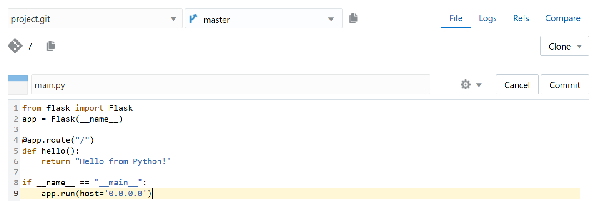
_ACERCA DEL CÓDIGO: Este código crea un backend de Python, que responde un mensaje de texto cuando se llama al servidor en el puerto 5000._

7. Haga clic en **Confirmar** en el lado derecho de la página, luego haga clic en **Confirmar** en la ventana emergente

8. En la barra izquierda, selecciona Git

9. Haga clic en + Archivo en el lado derecho de la página.

10. Rellene con la siguiente información:
    - *Nombre*: requirements.txt
    - *Contenido*: Copie el siguiente codigo - [requirements.txt](./src/requirements.txt)

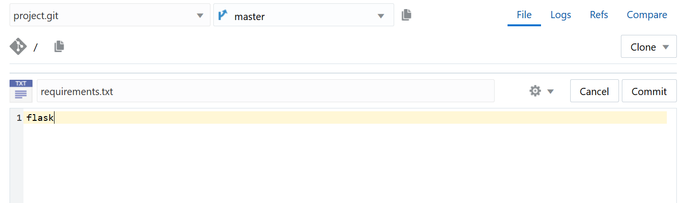
_ACERCA DEL CÓDIGO: El archivo require.txt enumera las bibliotecas necesarias para que se ejecute la aplicación python_

11. Haga clic en **Confirmar** en el lado derecho de la página, luego haga clic en **Confirmar** en la up window

## Crear el archivo Dockerfile
En este paso, agregará un archivo acoplable a su repositorio. El dockerfile es una representación declarativa de su contenedor y sus características.

1. En la barra izquierda, selecciona **Git**

2. Haga clic en **+ Archivo** en el lado derecho de la página.

3. Rellene con la siguiente información:
    - *Nombre*: Dockerfile 
    - *Contenido*: Copiar el siguiente enlace - [Dockerfile](./src/Dockerfile)

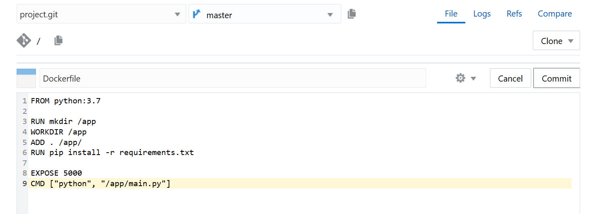
_ACERCA DEL CÓDIGO: este dockerfile utiliza una [Imagen Oficial de python](https://hub.docker.com/_/python) como base para crear una nueva imagen que contiene los archivos de la aplicación y las bibliotecas necesarias_

4. Haga clic en **Confirmar** en el lado derecho de la página, luego haga clic en Confirmar en up window

## Crear Build job
Ahora es el momento de crear el trabajo de automatización que transformará los códigos que ha creado en una imagen de contenedor y lo cargará en Oracle Cloud Infraestructure Registry.

1. En la barra izquierda, haga clic en **Builds**

2. Haga clic en **+ Crear trabajo** en la parte inferior de la página.
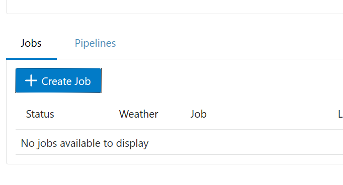

3. Rellene con la siguiente información:
    - *Nombre*: Build
    - *Template*: < Creado en  [Lab100](../Lab100/Lab100.md) >

4. Haga clic en Crear

5. En la pestaña **Git** , haga clic en **Agregar Git** en la esquina derecha de la página, luego seleccione **Git** en el menú desplegable

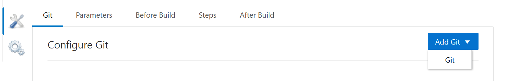

6. Seleccione su repositorio en el campo **Repositorio** requerido

7. En la **pestaña Pasos** , haga clic en **Agregar paso> Docker> Inicio de sesión de Docker**

8. Seleccione OCIR como su **host de registro**

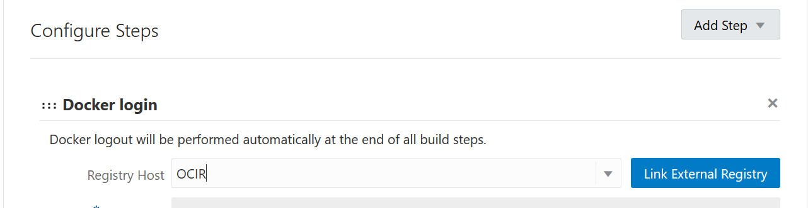

9. Siguiente paso, haz clic en **Agregar paso> Docker> Docker Build**

10. Rellene con la siguiente información:
    - *Nombre de la Imagen*: < Storage Namespace collected on [Lab100](../Lab100/Lab100.md) >/pythonapp
    - *Fuente*: Context Root in Workspace

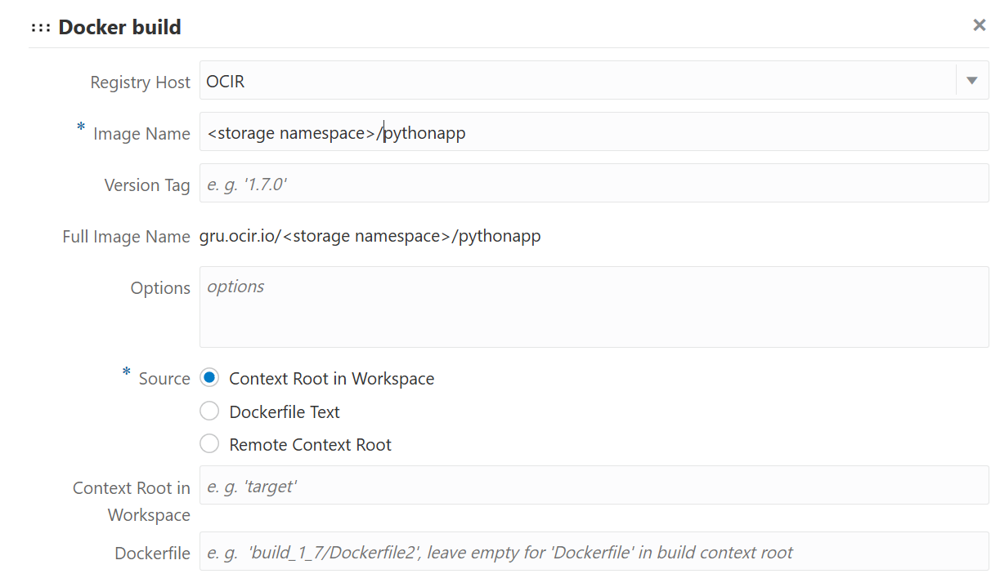

11. En la pestaña Pasos , haga clic en **Agregar paso> Docker> Docker Push**

12. Guarde el trabajo haciendo clic en **Guardar** en la parte superior de la página

## Probar el trabajo
En este paso, verificará en el registro y también en la infraestructura de Oracle Cloud que la imagen del contenedor se creó y cargó correctamente.

1. Haga clic en Construir ahora para comenzar el trabajo.

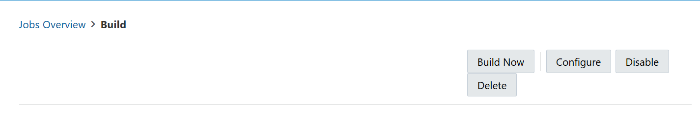

2. Haga clic en **Build Log** para monitorear la ejecución del trabajo.

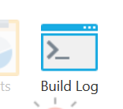

_AVISO: Esto puede tardar varios minutos ya que es la primera solicitud de trabajo. La VM de compilación debe activarse para ejecutar los pasos del trabajo_

3. Ahora para verificar la Infraestructura de Oracle Cloud, acceda a la consola OCI:
[Sign In](https://console.us-ashburn-1.oraclecloud.com/)

4. Ingrese su **nombre de arrendamiento** , luego haga clic en **Siguiente** .

5. En la página de inicio de sesión de Oracle Cloud Account, ingrese las credenciales de su cuenta de Oracle Cloud y haga clic en **Iniciar sesión** .

6. En la consola OCI, haga clic en el **ícono Menú** en la esquina superior izquierda.

7. En **Servicios para desarrolladores** , y luego seleccione **Registro (OCIR)** .

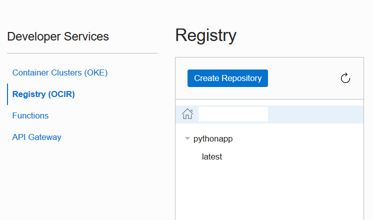

8. Antes de ir al siguiente laboratorio, haga clic en el **último en pythonapp** y copie la información de la **ruta completa** en el bloc de notas..

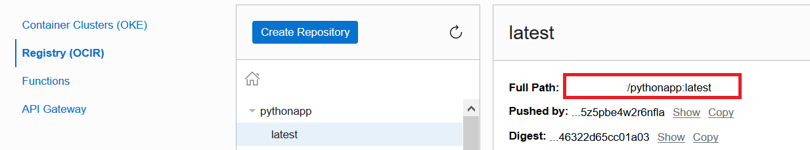

[<- Volver](../README.md)
