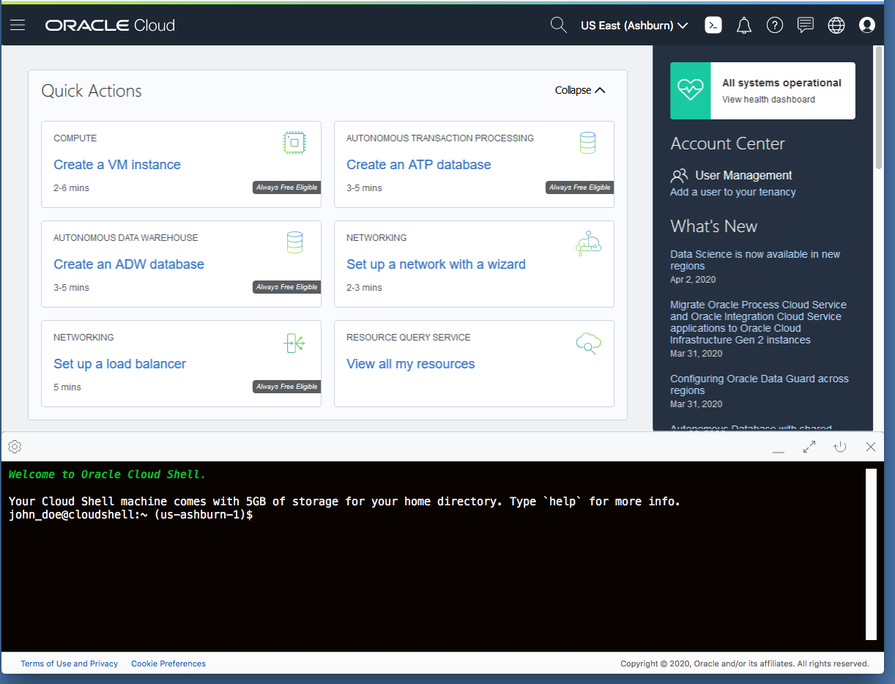
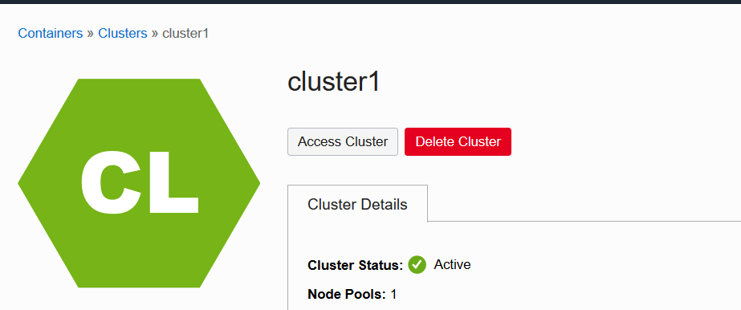
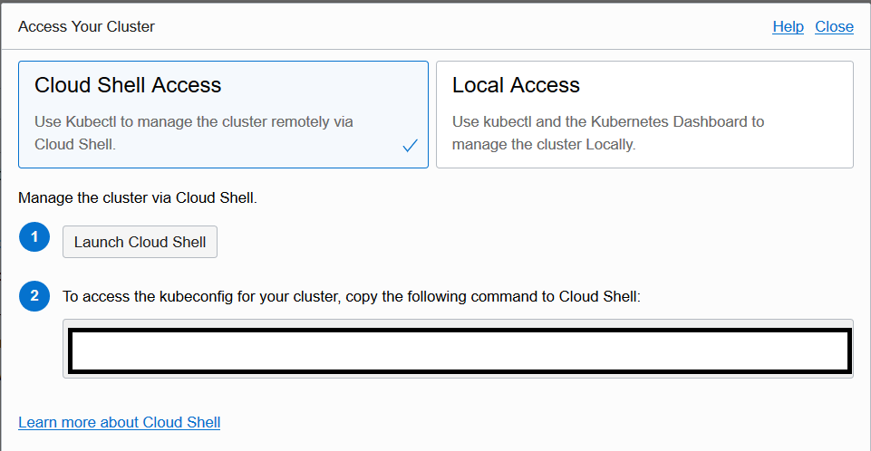
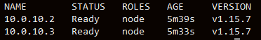

# Verificación del estado de la aplicación con Oracle Cloud Shell
Oracle Cloud Infrastructure Cloud (OCI) Shell es un terminal basado en un navegador web accesible desde la Consola Oracle Cloud. Cloud Shell es de uso gratuito y proporciona acceso a un shell de Linux, con una CLI de Oracle Cloud Infrastructure previamente autenticada, una instalación Ansible previamente autenticada y otras herramientas útiles para seguir los tutoriales y laboratorios de servicio de Oracle Cloud Infrastructure. Cloud Shell es una función disponible para todos los usuarios de OCI, accesible desde la consola.

## En este laboratorio usarás:

* Oracle Container Engine para Kubernetes (Kubernetes Cluster)
* Oracle Cloud Shell
* Oracle Cloud Infraestructure (Nube)
* Oracle Cloud Infraestructure Registry (Registro de contenedores)

## Inicializando el Cloud Shell

1. Inicie sesión en la consola. [Sign In](https://console.us-ashburn-1.oraclecloud.com/)

2. Haga clic en el icono de Cloud Shell en el encabezado de la consola. Tenga en cuenta que la CLI de OCI que se ejecuta en Cloud Shell    ejecutará comandos en la región seleccionada en el menú de selección Región de la consola cuando se inició Cloud Shell.

3. Esto muestra el Cloud Shell en un "Drawer" en la parte inferior de la consola

4. Cloud Bash ya tiene instalado el cliente oci, así que intentemos algunos comandos:  `oci iam compartment list`

_ACERCA DE: Este comando enumera todos los compartimentos en su arrendamiento_

`oci os ns get`

_ACERCA DE: Este comando muestra el espacio de nombres de almacenamiento de su arrendamiento_

**Accediendo a su Kubernetes Cluster usando Cloud Shell**
1. Acceda a la consola OCI: [Sign In](https://console.us-ashburn-1.oraclecloud.com/)

2. En la consola OCI, haga clic en el **ícono Menú** en la esquina superior izquierda.

3. En **Servicios de desarrollador** , y luego seleccione **Clústeres de contenedores (OKE)** .

4. Seleccione el clúster que creó para esta práctica de laboratorio.

5. En la parte superior de la página, haga clic en **Clúster de acceso**

6. Haga clic en **Iniciar Cloud Shell** y luego ejecute el comando que se muestra en la ventana emergente.

_IMPORTANTE: guarde el comando en el bloc de notas, será necesario para el próximo laboratorio_

7. Para probar la conexión, puede ejecutar el siguiente comando:
   
   `kubectl get nodes`
   
_ACERCA DE: Este comando enumera todos los nodos de su clúster_

** Creando el secreto para el registro**

Este paso creará un secreto en su token que le permitirá a su clúster kubernetes extraer imágenes de su Oracle Cloud Infraestructure Registry

Dentro de Cloud Shell, ejecute este comando cambiando la siguiente información:
docker-server: <URL de registro>
docker-username: <Espacio de nombres de almacenamiento> / <Nombre de usuario completo>
docker-password: '_<Auth Token>' IMPORTANTE: el Auth Token debe estar entre comillas_
docker-email: exemple@exemple.com
  
  `kubectl create secret docker-registry ocir --docker-server=<your-registry-server> --docker-username=<username> --docker-password='<password>' --docker-email=<your-email>`

[<- Volver](../README.md)
