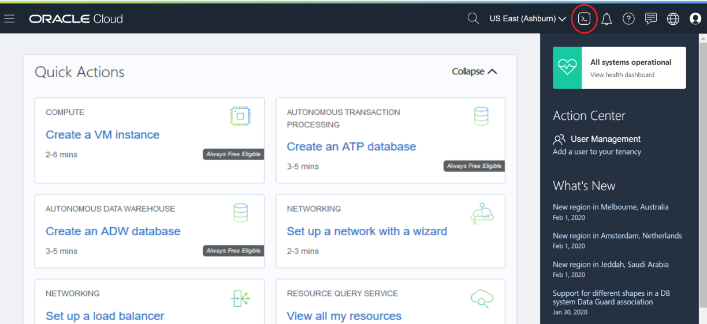

# Verificación del estado de la aplicación con Oracle Cloud Shell
Oracle Cloud Infrastructure Cloud (OCI) Shell es un terminal basado en un navegador web accesible desde la Consola Oracle Cloud. Cloud Shell es de uso gratuito y proporciona acceso a un shell de Linux, con una CLI de Oracle Cloud Infrastructure previamente autenticada, una instalación Ansible previamente autenticada y otras herramientas útiles para seguir los tutoriales y laboratorios de servicio de Oracle Cloud Infrastructure. Cloud Shell es una función disponible para todos los usuarios de OCI, accesible desde la consola.

## Inicializando el Cloud Shell

1. Inicie sesión en la consola. [Sign In](https://console.us-ashburn-1.oraclecloud.com/)

2. Haga clic en el icono de Cloud Shell en el encabezado de la consola. Tenga en cuenta que la CLI de OCI que se ejecuta en Cloud Shell    ejecutará comandos en la región seleccionada en el menú de selección Región de la consola cuando se inició Cloud Shell.

3. Esto muestra el Cloud Shell en un "Drawer" en la parte inferior de la consola

4. Cloud Bash ya tiene instalado el cliente oci, así que intentemos algunos comandos:`oci iam compartment list`

[<- Back](../README.md)
