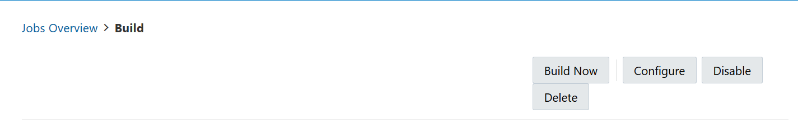
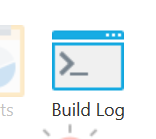

# Despliegue de un "job"
Ahora que ya se tiene configurada su plataforma de CI/CD, en el primer Job con su código en un conteiner y se encuentra cargada la imagen del conteiner en su registro, es hora de desplegar su aplicación en un clúster.

## Crea el archivo de Kubernates

1. Ingrese a la consola de **Visual Builder Studio** 

2. En la barra de la izquierda, haga click en **Organization**, luego click en **Projects**.

3. Seleccione el proyecto creado en el [Lab100](../Lab100/Lab100.md)

4. En la barra de lado izquierdo seleccione **Git**

5. Click en **+ File** en el costado izquierdo de la pagina

6. Llene con la siguiente información:
    - *Name*: deployment.yaml
    - *Content*: Copie el siguiente código - [deployment.yaml](./src/deployment.yaml)
    _IMPORTANTE: YAML usa indentación de espacios en blanco, por lo tanto cualquier espacio no identificado hará que el código no funcione, NO INTENTE REEMPLAZAR LOS ESPACIOES EN BLANCO CON TAB._

7. En **Línea 31 **, ingrese la **Dirección de la imagen** incluyendo el **Repository URL** información recolectada en el [Lab200](../Lab200/Lab200.md):


8. Click en **Commit** en la esquina derecha de la página, luego click en **Commit** en la ventana del menú pop up 

## Realizar el despliegue del job

1. En la barra del costado izquierdo haga clik en **Builds**

2. Click en **+ Create Job** en la parte inferior de la pagina 

3. Llena la siguiente información:
    - *Name*: Deploy
    - *Template*: < creada en [Lab100](../Lab100/Lab100.md) >

4. Click en **Create**

5. En el Tab de **Git**, en la esquina derecha de la página click en **Add Git** , y luego en el menú desplegable seleccione **Git** 

6. Seleccione su repositorio en el campo **Repository** 

7. Ingrese al tab **Steps**:
    
    7.1. El primer paso debe ser **OCIcli** donde se configurará la construcción de la VM (Máquina virtual) para acceder al tenancy usando el client. Ingrese la información solicitada:
    - *User OCID*: El OCID del usuario < Recolectado en [Lab100](../Lab100/Lab100.md) >
    - *Fingerprint*: El pair fingerprint de la llave < Recolectado en   [Lab100](../Lab100/Lab100.md) >
    - *Tenancy*: El Tenancy OCID del tenancy < Recolectado en [Lab100](../Lab100/Lab100.md) >
    - *Private Key*: Copiar la llave privada [private key](../Lab100/src/oci_api_key.pem)
    - *Region* : Selecciona la región de su Tenancy < Recolectado en  [Lab100](../Lab100/Lab100.md) >

    7.2 Como segundo paso usaremos el  **Common Build Tool > Unix Shell** para ejecutar los scripts en línea de comando de la VM creada:

    ```oci -v```

    ```mkdir -p $HOME/.kube```

    ```<Pegue el comando usado para conectarse al cloud bash de su cluster de kubernetes>``` Recolectado en [Lab300](../Lab300/Lab300.md)

    ```export KUBECONFIG=$HOME/.kube/config```
    
    Así debería verse al final:

    

    7.3 Como tercer y último paso usaremos **Common Build Tool > Unix Shell** para ejecutar scripts de kubernates en línea de comando de la VM creada:

    ```kubectl apply -f deployment.yaml```

    ```sleep 60```

    ```kubectl get deployments```

    ```kubectl get services```

    Así debería verse al final:

    

8. Click en **Build Now** para iniciar el job



9. Click en **Build Log** para monitorear la ejecución 



10. Se puede verificar si la aplicación funciona ingresando a la IP provista en los archivos de log, en el puerto 6000, para esto se puede usar **curl** por ejemplo:

Ingrese a su CMD, o consola de Power Shell, y ejecute el siguiente código:


```curl <service-ip>:6000 ```

[<- Volver](../README.md)
