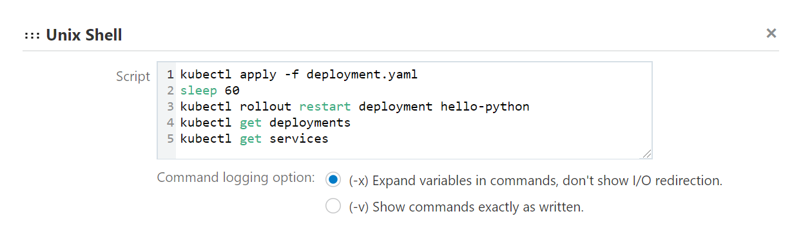

# Creating a Deploy job
Now that you already have configured your CI/CD platform, created your first job that contenerized your code, and uploaded your container image to your registry, is time to  deploy this application to your cluster.

## Creating the Kubernetes file

1. Access the **Visual Builder Studio** console

2. On the left bar, click on **Organization**, then click on **Projects**.

3. Select the project created on [Lab100](../Lab100/Lab100.md)

4. On the left bar select **Git**

5. Click on **+ File** on the right side of the page

6. Fill with the following information:
    - *Name*: deployment.yaml
    - *Content*: Copy the following code - [deployment.yaml](./src/deployment.yaml)
    _IMPORTANT: YAML uses whitespace identation, so any whitespace missing will cause the code to not work. DO NOT TRY TO REPLACE THE WHITESPACE WITH TAB._

7. At the **31th line**, input the **Full Image Path** including the **Repository URL** information that you collected on [Lab200](../Lab200/Lab200.md):


8. Click on **Commit** on the right side of the page, then click **Commit** on the pop up window

## Creating the deployment job

1. On the left bar click on **Builds**

2. Click on **+ Create Job** at the bottom of the page

3. Fill with the following information:
    - *Name*: Deploy
    - *Template*: < created on [Lab100](../Lab100/Lab100.md) >

4. Click on **Create**

5. On the **Git tab**, click on **Add Git** on the right corner of the page, thenselect **Git** in the dropdown menu

6. Select your repository on the **Repository** required field

7. Access the **Steps** tab:
    
    7.1. The first step must be **OCIcli** where you will configure the build VM to access your cloud tenancy through client. Fill the required information:
    - *User OCID*: Your user OCID < collected on [Lab100](../Lab100/Lab100.md) >
    - *Fingerprint*: Your Key pair fingerprint < collected on  [Lab100](../Lab100/Lab100.md) >
    - *Tenancy*: Your Tenancy OCID < collected on [Lab100](../Lab100/Lab100.md) >
    - *Private Key*: Copy the [private key](../Lab100/src/oci_api_key.pem)
    - *Region* : Select your tenancy home region < collected on [Lab100](../Lab100/Lab100.md) >

    7.2 For second step we will use **Common Build Tool > Unix Shell** to execute scripts on the command line of the build VM: 

    ```oci -v```

    ```mkdir -p $HOME/.kube```

    ```<Paste the command used to connect cloud bash with your kubernetes cluster>```Collected on [Lab300](../Lab300/Lab300.md)

    ```export KUBECONFIG=$HOME/.kube/config```
    
    Here is how it should look like at the end:

    

    7.3 For the third and last step we will use **Common Build Tool > Unix Shell** to execute kubernetes scripts on the command line of the build VM:

    ```kubectl apply -f deployment.yaml```

    ```sleep 60```

    ```kubectl rollout restart deployment hello-python```

    ```kubectl get deployments```

    ```kubectl get services```

    Here is how it should look like at the end:

    

8. Click on **Build Now** to start the job


9. Click on **Build Log** to monitor the job execution


10. You can check if this application works by calling the IP provided on the log files, on the port 6000, for that you can use **curl** for example, open your CMD, or Power Shell console, and execute the following code:

```curl <service-ip>:6000 ```


[<- Back](../README.md)