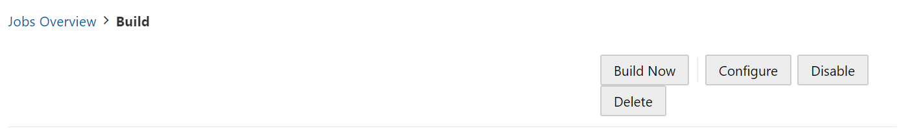
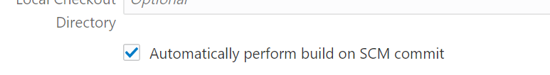
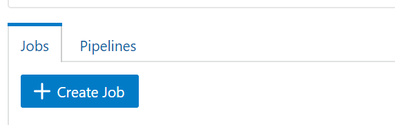
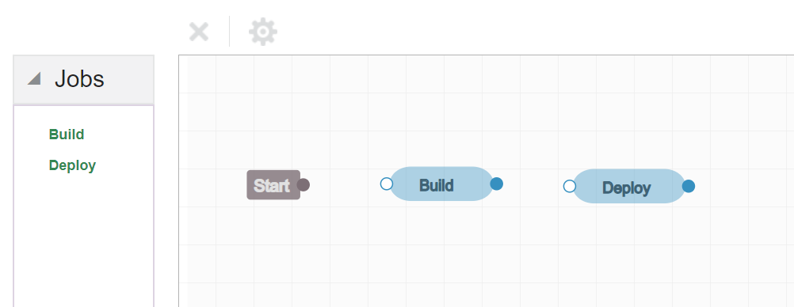
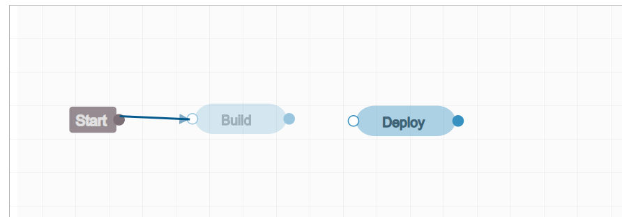
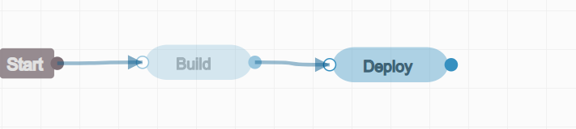
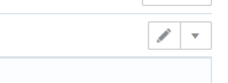
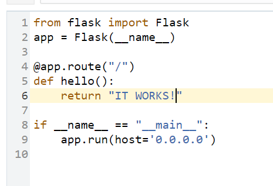
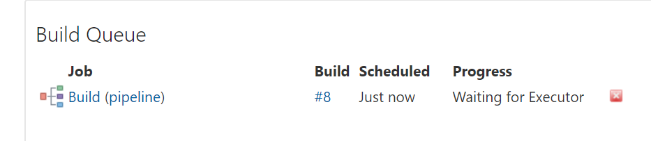
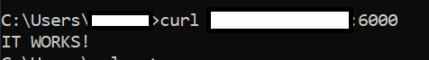

# Creating an Automated pipeline
Finally, after all the configuration is set and done, you can create a flow that automatizes the whole process.
At this lab you will create your first Visual Builder Studio pipeline, that monitors your git for new updates and then trigger your jobs when something has changed.

### At this lab you will use:

* Visual Builder Studio (CI/CD)
* Git (SCM)
* Python (Programming language)

## Configure the build job to react to git actions

1. Access the **Visual Builder Studio** console

2. On the left bar, click on **Organization**, then click on **Projects**.

3. Select the project created on [Lab100](../Lab100/Lab100.md)

4. On the left bar select **Builds**

5. Click on your **Build** job created on [Lab200](../Lab200/Lab200.md)

6. On the top right corner click on **Configure**:

7. At the **Git** tab check the option **Automatically perform build on SCM Commit**:

_ABOUT: Now every commit on your git repository will trigger this job automatically_

8. Click on **Save** at the top of the screen.

## Create the pipeline

1. Access the **Visual Builder Studio** console

2. On the left bar, click on **Organization**, then click on **Projects**.

3. Select the project created on [Lab100](../Lab100/Lab100.md)

4. On the left bar select **Builds**

5. Click on the **Pipeline** tab at the middle of the page:

6. Click on **+ Create Pipeline**

7. Give it a name, and then click on **Create**

8. Now you have the pipeline designer open, **drag and drop** both jobs to the chart:

_TIP: You dont have to put them in line, just leave them in a way that the whole job figure is totally visible_

9. The circles on the sides of the jobs are connection points, click on the **Start circle** and drag the arrow to the **Build job circle** on the **left side**:

10. Repeat the same process to connect the **right side of Buid Job** with the **left side of the Deploy job**:

11. Click on **Save** at the top of the page

## Testing
Now lets change you code to see the behavior of your application.

1. Access the **Visual Builder Studio** console

2. On the left bar, click on **Organization**, then click on **Projects**.

3. Select the project created on [Lab100](../Lab100/Lab100.md)

4. On the left bar select **Git**

5. Click on the **main.py** file, then click on the **pencil icon** on the top right corner to edit it:

6. Change the text message at the **6th line** to any message that you like, example:

7. Click on **Commit** at the top right corner, then click on **Commit** again on the pop up window

8. On the left bar select **Builds** to monitor the execution of your pipeline

9. Now try calling the same ip at the port 6000 to see if the message had changed:

There you have it, now every code update will impact directly on how your application will behave!

#### Thank you for completing this workshop, I hope that you had fun!

[<- Back](../README.md)